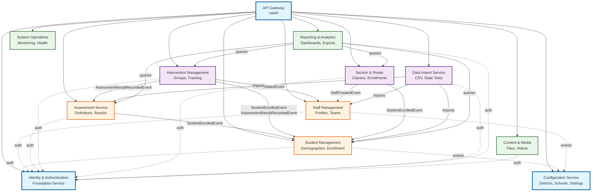
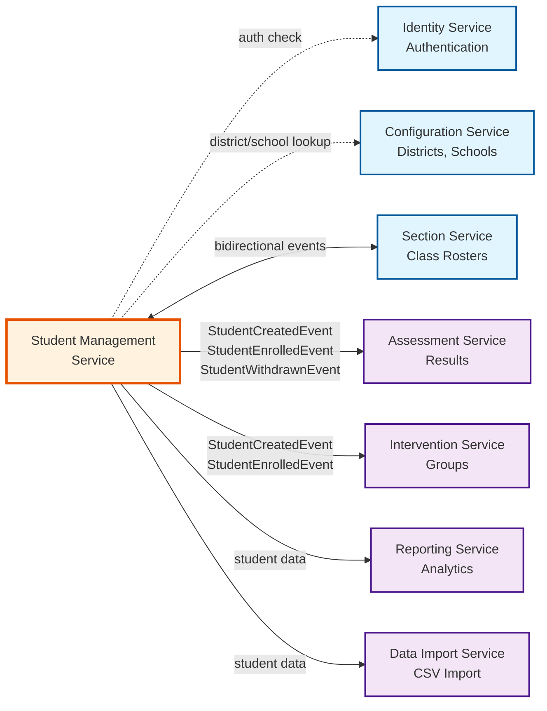
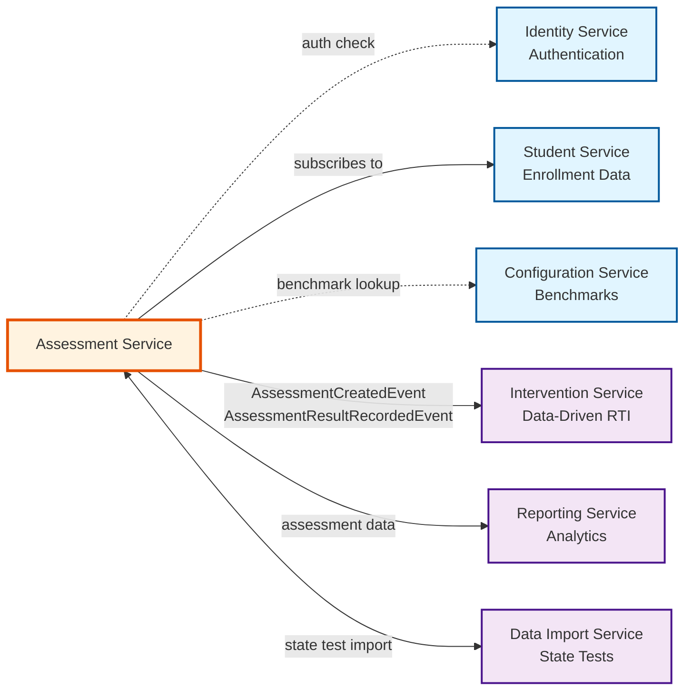
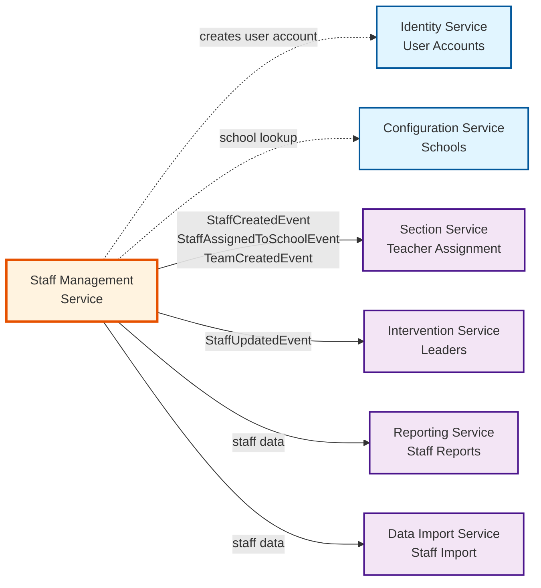
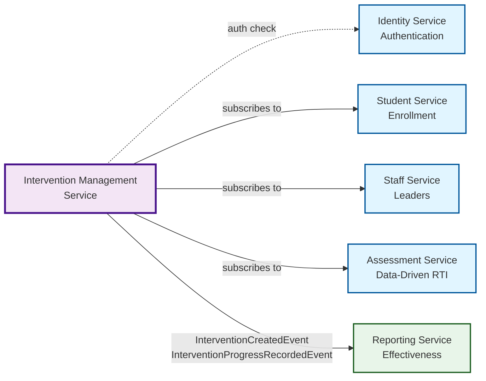
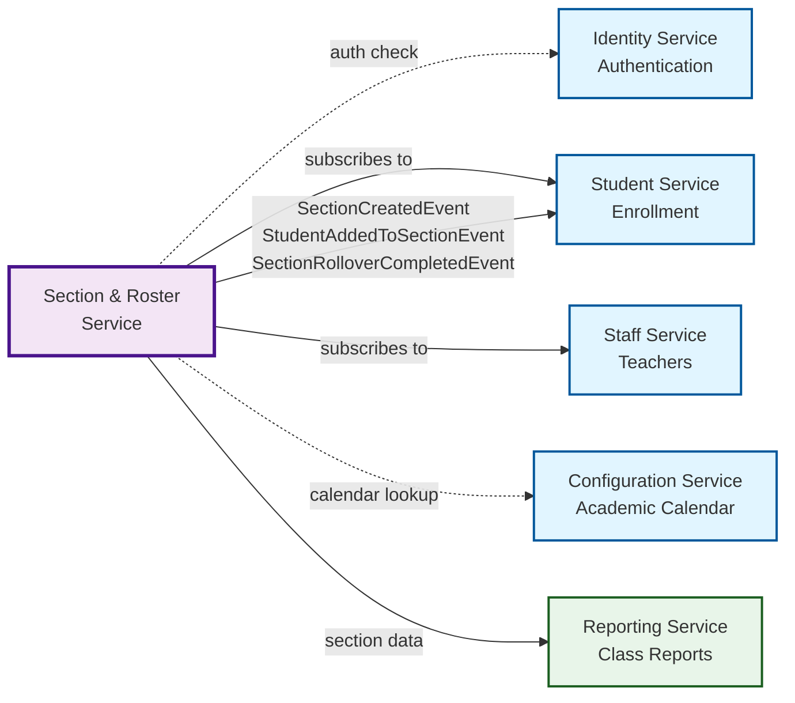
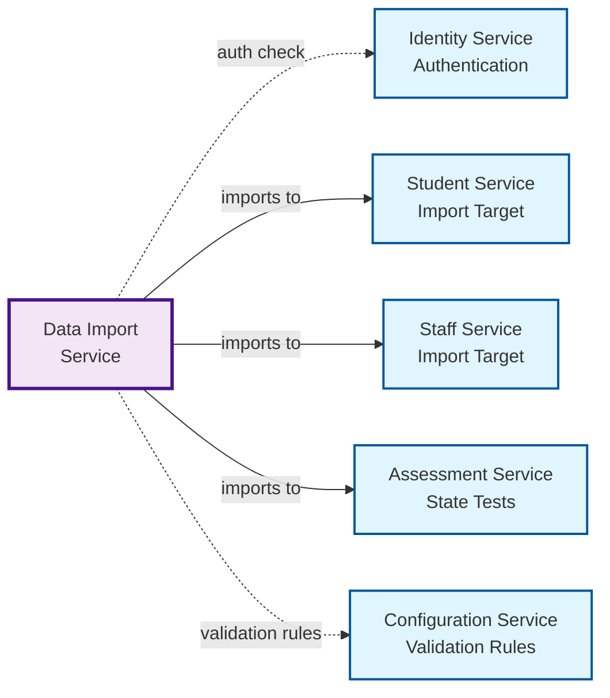
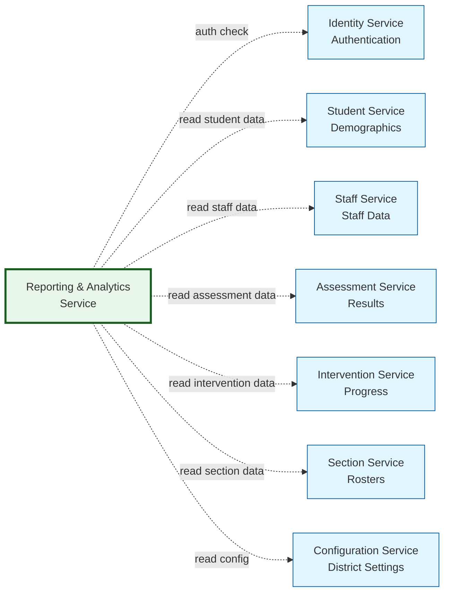

# Bounded Contexts - NorthStar Application

## Overview

This document defines the bounded contexts identified in the NorthStar application for microservices decomposition. Each bounded context represents a distinct area of the business domain with clear boundaries and responsibilities.

## Bounded Context Map

```
┌─────────────────────────────────────────────────────────────────┐
│                     NorthStar Education Platform                  │
└─────────────────────────────────────────────────────────────────┘
                              │
                              ├── Identity & Access Management
                              │   ├── Authentication
                              │   ├── Authorization
                              │   └── User Profile Management
                              │
                              ├── Student Management
                              │   ├── Student Demographics
                              │   ├── Student Enrollment
                              │   └── Student Dashboard
                              │
                              ├── Staff Management
                              │   ├── Staff Profiles
                              │   ├── Team Management
                              │   └── Staff Assignments
                              │
                              ├── Assessment
                              │   ├── Assessment Definition
                              │   ├── Assessment Administration
                              │   ├── Scoring & Benchmarks
                              │   └── Assessment Availability
                              │
                              ├── Intervention Management
                              │   ├── Intervention Planning
                              │   ├── Intervention Groups
                              │   ├── Intervention Tracking
                              │   └── Intervention Toolkit
                              │
                              ├── Academic Sections
                              │   ├── Section Management
                              │   ├── Roster Management
                              │   ├── Section Reporting
                              │   └── Automated Rollover
                              │
                              ├── Data Integration
                              │   ├── Data Import/Export
                              │   ├── State Test Data
                              │   ├── Data Validation
                              │   └── Data Entry
                              │
                              ├── Reporting & Analytics
                              │   ├── Report Generation
                              │   ├── Data Visualization
                              │   ├── Data Export
                              │   └── Print Services
                              │
                              ├── Content & Media
                              │   ├── File Management
                              │   ├── Media Storage (Azure)
                              │   └── Video Management
                              │
                              ├── Platform Configuration
                              │   ├── District Settings
                              │   ├── Calendar Management
                              │   ├── User Preferences
                              │   └── Filter Options
                              │
                              └── System Operations
                                  ├── Navigation & UI
                                  ├── System Health Monitoring
                                  └── Diagnostics
```

## 1. Identity & Access Management Context

### Purpose
Manage user authentication, authorization, and profile information across the platform.

### Capabilities
- User authentication (login/logout)
- Password management and reset
- JWT token generation and validation
- Role and permission management
- User profile management
- Session management

### Key Entities
- User
- Role
- Permission
- UserClaim
- RefreshToken

### Dependencies
- None (foundation service)

### Exposed Events
- `UserLoggedInEvent`
- `UserLoggedOutEvent`
- `UserPasswordChangedEvent`
- `UserProfileUpdatedEvent`
- `UserRoleChangedEvent`

### API Endpoints
- `POST /api/v1/auth/login`
- `POST /api/v1/auth/logout`
- `POST /api/v1/auth/refresh`
- `POST /api/v1/auth/forgot-password`
- `POST /api/v1/auth/reset-password`
- `GET /api/v1/users/{id}`
- `PUT /api/v1/users/{id}`

## 2. Student Management Context

### Purpose
Manage all student-related information including demographics, enrollment, and student dashboards.

### Capabilities
- Student profile management
- Student enrollment tracking
- Student demographics
- Student dashboard data
- Student search and filtering

### Key Entities
- Student
- StudentEnrollment
- StudentDemographics
- StudentContact
- StudentNote

### Dependencies
- Identity & Access Management (for user association)
- Section & Roster (for class enrollment)

### Subscribed Events
- `SectionCreatedEvent`
- `SectionDeletedEvent`
- `UserCreatedEvent`

### Exposed Events
- `StudentCreatedEvent`
- `StudentUpdatedEvent`
- `StudentEnrolledEvent`
- `StudentWithdrawnEvent`
- `StudentDemographicsChangedEvent`

### API Endpoints
- `GET /api/v1/students`
- `GET /api/v1/students/{id}`
- `POST /api/v1/students`
- `PUT /api/v1/students/{id}`
- `DELETE /api/v1/students/{id}`
- `GET /api/v1/students/{id}/dashboard`
- `GET /api/v1/students/{id}/enrollment-history`

## 3. Staff Management Context

### Purpose
Manage staff profiles, team organization, and staff assignments.

### Capabilities
- Staff profile management
- Team creation and management
- Staff-to-team assignments
- Meeting scheduling
- Staff search and filtering

### Key Entities
- Staff
- Team
- TeamMember
- StaffAssignment
- Meeting

### Dependencies
- Identity & Access Management (for user association)

### Subscribed Events
- `UserCreatedEvent`
- `UserUpdatedEvent`

### Exposed Events
- `StaffCreatedEvent`
- `StaffUpdatedEvent`
- `TeamCreatedEvent`
- `TeamMemberAddedEvent`
- `TeamMemberRemovedEvent`
- `MeetingScheduledEvent`

### API Endpoints
- `GET /api/v1/staff`
- `GET /api/v1/staff/{id}`
- `POST /api/v1/staff`
- `PUT /api/v1/staff/{id}`
- `GET /api/v1/teams`
- `POST /api/v1/teams`
- `POST /api/v1/teams/{id}/members`
- `GET /api/v1/meetings`

## 4. Assessment Context

### Purpose
Manage assessment definitions, administration, scoring, and benchmarks.

### Capabilities
- Assessment definition and configuration
- Assessment field management
- Benchmark management
- Assessment availability scheduling
- Assessment scoring
- Assessment result tracking

### Key Entities
- Assessment
- AssessmentField
- AssessmentFieldCategory
- AssessmentFieldGroup
- AssessmentBenchmark
- AssessmentAvailability
- AssessmentResult

### Dependencies
- Student Management (for assessment results)
- Configuration (for district benchmarks)

### Subscribed Events
- `StudentEnrolledEvent`
- `DistrictSettingsUpdatedEvent`

### Exposed Events
- `AssessmentCreatedEvent`
- `AssessmentUpdatedEvent`
- `AssessmentResultRecordedEvent`
- `BenchmarkDefinedEvent`
- `AssessmentAvailabilityChangedEvent`

### API Endpoints
- `GET /api/v1/assessments`
- `GET /api/v1/assessments/{id}`
- `POST /api/v1/assessments`
- `PUT /api/v1/assessments/{id}`
- `GET /api/v1/assessments/{id}/fields`
- `GET /api/v1/benchmarks`
- `POST /api/v1/benchmarks`
- `GET /api/v1/assessments/{id}/availability`
- `POST /api/v1/assessments/{id}/results`

## 5. Intervention Management Context

### Purpose
Plan, track, and manage student interventions and intervention groups.

### Capabilities
- Intervention planning
- Intervention group management
- Student assignment to interventions
- Intervention attendance tracking
- Intervention toolkit resources
- Intervention effectiveness tracking

### Key Entities
- Intervention
- InterventionGroup
- InterventionAttendance
- InterventionStudent
- InterventionResource

### Dependencies
- Student Management (for student assignments)
- Staff Management (for intervention leaders)
- Assessment (for data-driven interventions)

### Subscribed Events
- `StudentEnrolledEvent`
- `AssessmentResultRecordedEvent`
- `StaffUpdatedEvent`

### Exposed Events
- `InterventionCreatedEvent`
- `InterventionGroupCreatedEvent`
- `StudentAddedToInterventionEvent`
- `StudentRemovedFromInterventionEvent`
- `InterventionAttendanceRecordedEvent`

### API Endpoints
- `GET /api/v1/interventions`
- `POST /api/v1/interventions`
- `GET /api/v1/intervention-groups`
- `POST /api/v1/intervention-groups`
- `POST /api/v1/intervention-groups/{id}/students`
- `POST /api/v1/intervention-groups/{id}/attendance`
- `GET /api/v1/intervention-toolkit`

## 6. Academic Sections Context

### Purpose
Manage class sections, rosters, and automated rollover processes.

### Capabilities
- Section creation and management
- Student roster management
- Section reporting
- Automated year-end rollover
- Section data entry
- Section enrollment tracking

### Key Entities
- Section
- SectionRoster
- SectionEnrollment
- RolloverConfiguration
- SectionSchedule

### Dependencies
- Student Management (for roster)
- Staff Management (for teacher assignment)
- Configuration (for academic calendar)

### Subscribed Events
- `StudentEnrolledEvent`
- `StudentWithdrawnEvent`
- `StaffUpdatedEvent`
- `CalendarUpdatedEvent`

### Exposed Events
- `SectionCreatedEvent`
- `SectionUpdatedEvent`
- `SectionDeletedEvent`
- `StudentRosteredEvent`
- `StudentUnrosteredEvent`
- `RolloverCompletedEvent`

### API Endpoints
- `GET /api/v1/sections`
- `POST /api/v1/sections`
- `PUT /api/v1/sections/{id}`
- `GET /api/v1/sections/{id}/roster`
- `POST /api/v1/sections/{id}/roster`
- `DELETE /api/v1/sections/{id}/roster/{studentId}`
- `GET /api/v1/sections/{id}/reports`
- `POST /api/v1/sections/rollover`

## 7. Data Integration Context

### Purpose
Handle data import, export, validation, and state test data integration.

### Capabilities
- CSV/Excel data import
- State test data import
- Data validation and error reporting
- Bulk data entry
- Data export functionality
- Import history and audit

### Key Entities
- DataImport
- ImportValidation
- ImportError
- StateTestData
- DataTemplate

### Dependencies
- Student Management (for student data)
- Assessment (for assessment data)
- Staff Management (for staff data)

### Subscribed Events
- None (initiates data creation events)

### Exposed Events
- `DataImportStartedEvent`
- `DataImportCompletedEvent`
- `DataImportFailedEvent`
- `DataValidationCompletedEvent`
- `StateTestDataImportedEvent`

### API Endpoints
- `POST /api/v1/imports/students`
- `POST /api/v1/imports/assessments`
- `POST /api/v1/imports/state-test-data`
- `GET /api/v1/imports/{id}/status`
- `GET /api/v1/imports/{id}/errors`
- `GET /api/v1/imports/templates`
- `POST /api/v1/exports/data`

## 8. Reporting & Analytics Context

### Purpose
Generate reports, visualizations, and provide data export capabilities.

### Capabilities
- Report generation (various types)
- Data visualization (charts, graphs)
- Print-friendly report formatting
- Data aggregation and analysis
- Scheduled report generation
- Report templates

### Key Entities
- Report
- ReportTemplate
- ReportParameter
- Chart
- DataAggregation

### Dependencies
- All domain services (read-only access for reporting)

### Subscribed Events
- All domain events (for materialized views)

### Exposed Events
- `ReportGeneratedEvent`
- `ReportScheduledEvent`

### API Endpoints
- `GET /api/v1/reports`
- `POST /api/v1/reports/generate`
- `GET /api/v1/reports/{id}`
- `GET /api/v1/charts/line-graph`
- `GET /api/v1/charts/stacked-bar`
- `POST /api/v1/reports/export`
- `POST /api/v1/reports/print`

## 9. Content & Media Context

### Purpose
Manage file uploads, media storage, and video content.

### Capabilities
- File upload and storage
- Azure Blob Storage integration
- Video management
- File metadata tracking
- File download and streaming
- Storage quota management

### Key Entities
- File
- FileMetadata
- Video
- StorageBlob
- UploadSession

### Dependencies
- Identity & Access Management (for access control)

### Subscribed Events
- `UserDeletedEvent`

### Exposed Events
- `FileUploadedEvent`
- `FileDeletedEvent`
- `VideoUploadedEvent`
- `VideoProcessedEvent`

### API Endpoints
- `POST /api/v1/files/upload`
- `GET /api/v1/files/{id}`
- `DELETE /api/v1/files/{id}`
- `GET /api/v1/files/{id}/download`
- `POST /api/v1/videos/upload`
- `GET /api/v1/videos/{id}`
- `GET /api/v1/storage/quota`

## 10. Platform Configuration Context

### Purpose
Manage district-wide settings, calendars, and user preferences.

### Capabilities
- District settings management
- Academic calendar management
- User personal settings
- System-wide filter options
- Feature flags
- Configuration versioning

### Key Entities
- DistrictSettings
- Calendar
- CalendarEvent
- UserPreference
- FilterOption
- FeatureFlag

### Dependencies
- Identity & Access Management (for user preferences)

### Subscribed Events
- `UserCreatedEvent`

### Exposed Events
- `DistrictSettingsUpdatedEvent`
- `CalendarUpdatedEvent`
- `UserPreferenceChangedEvent`
- `FeatureFlagToggledEvent`

### API Endpoints
- `GET /api/v1/configuration/district`
- `PUT /api/v1/configuration/district`
- `GET /api/v1/calendars`
- `POST /api/v1/calendars`
- `GET /api/v1/users/{id}/preferences`
- `PUT /api/v1/users/{id}/preferences`
- `GET /api/v1/filter-options`

## 11. System Operations Context

### Purpose
Provide navigation structure, system health monitoring, and diagnostics.

### Capabilities
- Navigation menu generation
- System health checks
- Service diagnostics
- Performance monitoring
- Error tracking
- Feature availability

### Key Entities
- NavigationItem
- HealthCheck
- DiagnosticResult
- SystemMetric

### Dependencies
- All services (for health monitoring)

### Subscribed Events
- All critical events (for monitoring)

### Exposed Events
- `ServiceHealthChangedEvent`
- `PerformanceDegradedEvent`

### API Endpoints
- `GET /api/v1/navigation`
- `GET /api/v1/health`
- `GET /api/v1/health/ready`
- `GET /api/v1/diagnostics`
- `GET /api/v1/diagnostics/probe`
- `GET /api/v1/metrics`

## Context Relationships

### Upstream/Downstream Dependencies

```
Identity & Auth (U)
    ↓ downstream to
    - Student Management (D)
    - Staff Management (D)
    - Configuration (D)
    - Content & Media (D)

Student Management (U)
    ↓ downstream to
    - Assessment (D)
    - Intervention (D)
    - Section & Roster (D)
    - Data Integration (D)

Staff Management (U)
    ↓ downstream to
    - Intervention (D)
    - Section & Roster (D)

Assessment (U)
    ↓ downstream to
    - Intervention (D)
    - Reporting (D)

All Domain Services (U)
    ↓ downstream to
    - Reporting & Analytics (D)
    - System Operations (D)
```

### Shared Kernel
- Common DTOs (e.g., pagination, filtering)
- Common exceptions
- Common validation rules
- Logging abstractions
- Event base classes

### Anti-Corruption Layers
- Legacy database adapters
- External API wrappers
- Message transformation services

## Integration Patterns

### Synchronous (REST)
- User-initiated queries
- Real-time data requirements
- Request-response patterns

### Asynchronous (Events)
- Domain events for decoupling
- Eventually consistent data
- Audit trails

### Data Replication
- Read-only replicas for reporting
- Cached reference data
- Materialized views

## Service Dependency Diagrams

### Overview Dependency Graph

The following diagram shows the high-level dependencies between all microservices in the NorthStar LMS platform:



**Legend**:
- **Solid arrows** (→): Direct event subscriptions (event-driven dependencies)
- **Dotted arrows** (-.->): Authentication checks or configuration lookups (lightweight dependencies)
- **Color coding**:
  - 🔵 **Blue**: Foundation Services (Phase 1)
  - 🟠 **Orange**: Core Domain Services (Phase 2)
  - 🟣 **Purple**: Secondary Domain Services (Phase 3)
  - 🟢 **Green**: Supporting Services (Phase 4)

---

### Student Management Service Dependencies



**Events Published**:
- `StudentCreatedEvent` → Assessment, Intervention, Reporting
- `StudentEnrolledEvent` → Assessment, Intervention, Section
- `StudentWithdrawnEvent` → Assessment, Intervention, Section
- `StudentDemographicsChangedEvent` → Reporting

**Events Subscribed**:
- `SectionCreatedEvent` (from Section Service)
- `SchoolClosedEvent` (from Configuration Service)

---

### Assessment Service Dependencies



**Events Published**:
- `AssessmentCreatedEvent` → Reporting
- `AssessmentAssignedEvent` → Student (notification), Reporting
- `AssessmentResultRecordedEvent` → Intervention, Reporting
- `BenchmarkCreatedEvent` → Configuration

**Events Subscribed**:
- `StudentEnrolledEvent` (from Student Service) → Auto-assign grade-level assessments
- `DistrictSettingsUpdatedEvent` (from Configuration Service) → Update benchmark thresholds

---

### Staff Management Service Dependencies



**Events Published**:
- `StaffCreatedEvent` → Identity (create user), Section
- `StaffAssignedToSchoolEvent` → Section, Configuration
- `TeamCreatedEvent` → Notification Service (future)
- `StaffCertificationExpiringEvent` → Notification Service (future)

**Events Subscribed**:
- `UserCreatedEvent` (from Identity Service) → Link user to staff profile
- `SchoolCreatedEvent` (from Configuration Service) → Enable staff assignment

---

### Intervention Management Service Dependencies



**Events Published**:
- `InterventionCreatedEvent` → Reporting
- `StudentAddedToInterventionEvent` → Student (notification), Reporting
- `InterventionProgressRecordedEvent` → Reporting
- `InterventionCompletedEvent` → Reporting

**Events Subscribed**:
- `StudentEnrolledEvent` (from Student Service) → Enable intervention enrollment
- `AssessmentResultRecordedEvent` (from Assessment Service) → Trigger data-driven intervention recommendations
- `StaffUpdatedEvent` (from Staff Service) → Update intervention leader assignments

---

### Section & Roster Service Dependencies



**Events Published**:
- `SectionCreatedEvent` → Student, Reporting
- `StudentAddedToSectionEvent` → Student (enrollment confirmation), Reporting
- `StudentRemovedFromSectionEvent` → Student, Reporting
- `SectionRolloverCompletedEvent` → Configuration, Reporting

**Events Subscribed**:
- `StudentEnrolledEvent` (from Student Service) → Enable roster assignment
- `StaffCreatedEvent` (from Staff Service) → Enable teacher assignment
- `CalendarUpdatedEvent` (from Configuration Service) → Trigger automated rollover

---

### Data Import Service Dependencies



**Events Published**:
- `DataImportStartedEvent` → Monitoring
- `DataImportCompletedEvent` → Notification Service (future)
- `DataImportFailedEvent` → Monitoring, Notification

**Events Subscribed**:
- None (initiates import workflows, doesn't react to events)

---

### Reporting & Analytics Service Dependencies



**Events Published**:
- `ReportGeneratedEvent` → Notification Service (future)
- `ExportCompletedEvent` → Notification Service (future)

**Events Subscribed** (for read model updates):
- `StudentCreatedEvent`, `StudentEnrolledEvent` (from Student)
- `AssessmentResultRecordedEvent` (from Assessment)
- `InterventionProgressRecordedEvent` (from Intervention)
- `SectionCreatedEvent`, `StudentAddedToSectionEvent` (from Section)
- All events → Update CQRS read models for dashboards

**Note**: Reporting Service uses **read-only queries** and **CQRS read models** materialized from domain events to avoid coupling to other services.

---

## Conclusion

These bounded contexts provide clear service boundaries for the microservices architecture. Each context has:
- Well-defined responsibilities
- Clear dependencies
- Defined events and APIs
- Minimal coupling with other contexts

The dependency diagrams above visualize:
- **Service-to-service dependencies** (solid arrows for event subscriptions)
- **Authentication and configuration lookups** (dotted arrows for lightweight dependencies)
- **Data flow direction** (upstream dependencies vs. downstream consumers)
- **Implementation phases** (color-coded by phase priority)

---

**Version**: 2.0  
**Last Updated**: 2025-11-20  
**Status**: Complete with Dependency Diagrams
